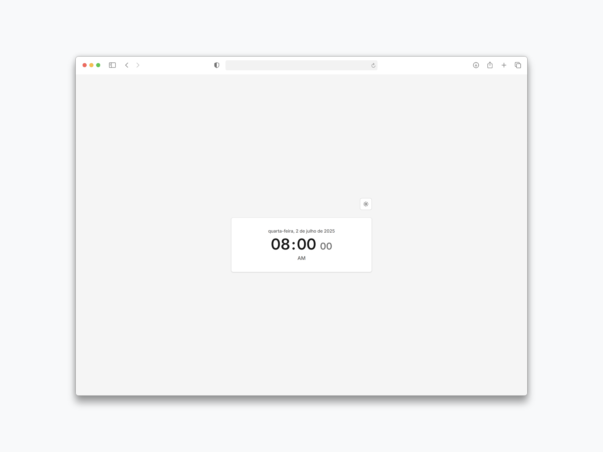
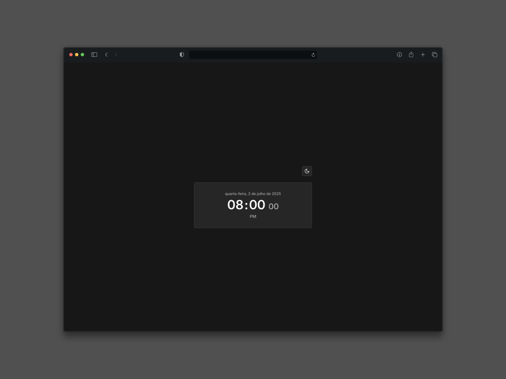
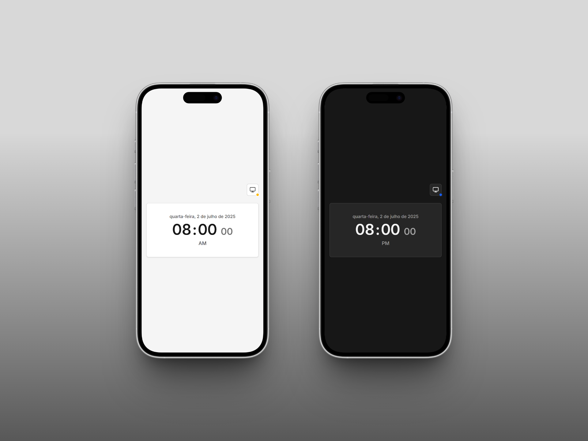

# Angular Digital Clock Demo

Este projeto é uma aplicação de relógio digital desenvolvida para praticar e demonstrar recursos modernos do Angular 19+, como signals para gerenciamento reativo de estado, control flow nativo (`@if`, `@for`), standalone components e outras boas práticas recomendadas pela equipe Angular. A aplicação também implementa modo noturno e utiliza Tailwind CSS para estilização.

## Objetivo

O objetivo deste projeto é servir como um exemplo prático e didático de como construir aplicações Angular modernas, utilizando as funcionalidades mais recentes do framework para garantir código limpo, eficiente e de fácil manutenção. O relógio digital implementa:

- Gerenciamento de estado local com signals
- Uso de control flow nativo no template
- Componentização seguindo o padrão standalone
- Sistema de temas (modo claro/escuro) com persistência
- Estilização moderna com Tailwind CSS
- Atualização em tempo real do horário
- Boas práticas de performance e arquitetura

## Pré-requisitos

- [Node.js](https://nodejs.org/en/download) (versão recomendada: 18+)
- [Angular CLI](https://v19.angular.dev/installation) (versão 19+)

## Como Executar

Siga os passos abaixo para executar o projeto:

1. Clone este repositório em sua máquina local:

   ```bash
   git clone https://github.com/kauatwn/angular-digital-clock-demo.git
   ```

2. Acesse a pasta do projeto:

   ```bash
   cd angular-digital-clock-demo
   ```

3. Instale as dependências:

   ```bash
   npm install
   ```

4. Inicie o servidor de desenvolvimento:

   ```bash
   npm start
   ```

5. Acesse a aplicação em [http://localhost:4200](http://localhost:4200).

## Screenshots

Abaixo alguns exemplos da interface da aplicação:





## Estrutura do Projeto

O projeto está organizado da seguinte forma:

```plaintext
angular-digital-clock-demo/
└── src/
    ├── app/
    │   ├── core/
    │   │   ├── models/
    │   │   │   ├── index.ts
    │   │   │   └── theme.models.ts
    │   │   └── services/
    │   │       └── theme.service.ts
    │   ├── features/
    │   │   └── clock/
    │   │       ├── components/
    │   │       │   ├── clock-date/
    │   │       │   └── clock-time-unit/
    │   │       ├── models/
    │   │       │   ├── clock.models.ts
    │   │       │   └── index.ts
    │   │       ├── services/
    │   │       │   └── clock.service.ts
    │   │       └── clock.component.*
    │   ├── shared/
    │   │   └── components/
    │   │       └── theme-toggle/
    │   ├── app.component.*
    │   ├── app.config.ts
    │   └── app.routes.ts
    ├── index.html
    ├── main.ts
    └── styles.css
```

Cada componente do relógio é independente, focado em uma única responsabilidade e utiliza signals para o gerenciamento de estado. O sistema de temas permite alternar entre modo claro e escuro, com persistência das preferências do usuário.
